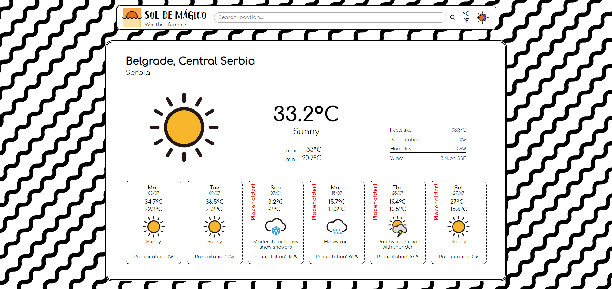
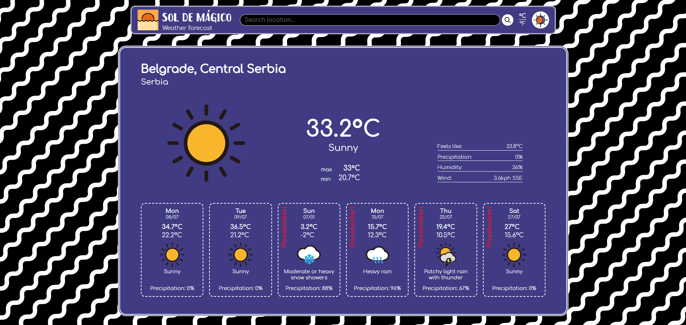
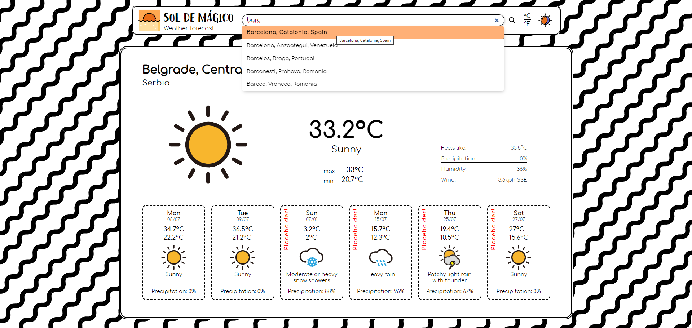

# Weather App

This is a Weather app project made with Weather API.

### <a href="https://dimitrije108.github.io/weather-app/">LIVE VERSION</a>

## Implementation

- Used as practice for asynchronous code implementation;
- Made using promises and refactored into async/await so both could be practiced;
- Working with API's - fetching, processing, implementing data;

---

